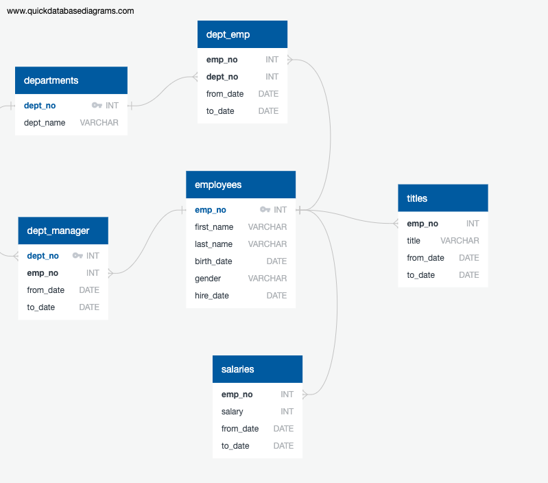

# sql-challenge

Dependencies/Tools:

ERD sketch tool, such as QuickDatabaseDiagrams

SQL database (PostgreSQL used here)

SQL client (used pgAdmin)

Docker container (used for hosting SQL database + client). YAML file for Postgres + pgAdmin found here

(BONUS) pandas + sqlalchemy modules in Python

